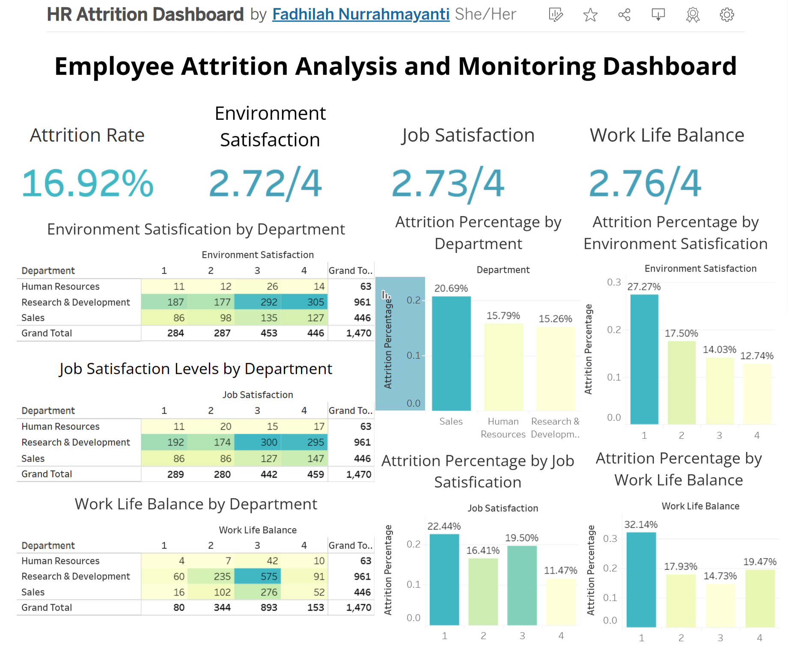

# Belajar Penerapan Data Science: Menyelesaikan Permasalahan Human Resource Attrition

- **Name:** Fadhilah Nurrahmayanti
- **Email:** a117xbm150@devacademy.id
- **ID Dicoding:** dilaafn

## Business Understanding

### Latar Belakang Bisnis

Jaya Jaya Maju adalah perusahaan multinasional yang telah berdiri sejak tahun 2000 dan memiliki lebih dari 1000 karyawan yang tersebar di berbagai wilayah di Indonesia. Seiring pertumbuhan perusahaan yang pesat, pengelolaan sumber daya manusia menjadi semakin kompleks dan menantang. Salah satu isu kritis yang dihadapi saat ini adalah tingginya tingkat attrition, yaitu rasio karyawan yang keluar dibandingkan dengan total jumlah karyawan.

Meskipun perusahaan telah berkembang menjadi organisasi besar, angka attrition yang melebihi 10% menunjukkan adanya permasalahan mendasar yang perlu segera diatasi. Tingginya tingkat perputaran karyawan tidak hanya berdampak pada biaya rekrutmen dan pelatihan, tetapi juga dapat menurunkan produktivitas serta semangat kerja tim yang tersisa.

Departemen Human Resources (HR) menyadari bahwa pendekatan konvensional dalam mengelola karyawan sudah tidak lagi efektif. Oleh karena itu, diperlukan pendekatan berbasis data untuk memahami secara mendalam faktor-faktor apa saja yang memengaruhi keputusan karyawan untuk meninggalkan perusahaan. Melalui proyek ini, dilakukan analisis menyeluruh terhadap data karyawan yang tersedia untuk mengidentifikasi pola, tren, dan faktor utama yang berkontribusi terhadap attrition. Selain itu, dibangun pula sebuah model prediktif yang dapat membantu memetakan risiko keluarnya karyawan di masa depan. Hasil analisis ini kemudian divisualisasikan dalam bentuk dashboard interaktif yang dapat digunakan oleh manajemen HR sebagai alat bantu pengambilan keputusan.

Dengan adanya pendekatan ini, perusahaan diharapkan dapat merumuskan strategi yang lebih efektif untuk meningkatkan retensi karyawan, menciptakan lingkungan kerja yang lebih sehat dan mendukung, serta pada akhirnya meningkatkan kinerja dan daya saing perusahaan secara keseluruhan.

### Permasalahan Bisnis

Masalah-masalah bisnis yang melatarbelakangi proyek ini antara lain:
1. Tingginya angka attrition: Tingkat karyawan yang keluar mencapai lebih dari 10%, yang jauh di atas ambang normal. Hal ini menjadi sinyal adanya ketidakpuasan atau ketidakcocokan dalam lingkungan kerja perusahaan.
2. Minimnya pemahaman atas penyebab attrition: Hingga saat ini, perusahaan belum memiliki pemahaman menyeluruh mengenai faktor-faktor apa saja yang paling berpengaruh terhadap keputusan karyawan untuk keluar.
3. Dampak terhadap produktivitas dan biaya operasional: Tingginya angka pergantian karyawan menimbulkan beban biaya rekrutmen dan pelatihan ulang, serta berpotensi menurunkan produktivitas karena hilangnya pengalaman kerja yang sudah terakumulasi.
4. Kebutuhan akan pengambilan keputusan berbasis dashboard: Manajemen HR membutuhkan alat bantu visual seperti dashboard untuk memantau faktor-faktor yang memengaruhi retensi karyawan secara real-time dan informatif.

### Cakupan Proyek

Proyek ini mencakup:
1. Eksplorasi dan Pembersihan Data
    - Menggunakan dataset `employee_data.csv` yang berisi informasi karyawan seperti usia, jenis kelamin, divisi, status pernikahan, gaji, dan status attrition.
    - Melakukan pengecekan missing values, duplikasi, dan konsistensi data.
    - Mengubah tipe data yang sesuai (misalnya pada kolom kategori), serta encoding pada variabel kategorikal.
2. Analisis Eksploratori (Exploratory Data Analysis / EDA)
    - Visualisasi distribusi berbagai variabel (usia, divisi, jenjang pendidikan, dll).
    - Analisis hubungan antara fitur-fitur tertentu terhadap attrition, misalnya:
        - Apakah karyawan dari divisi tertentu lebih banyak keluar?
        - Apakah tingkat gaji berpengaruh terhadap tingkat attrition?
        - Apakah usia atau status pernikahan memengaruhi keputusan keluar?
3. Identifikasi Faktor-Faktor Penyebab Tingginya Attrition
    - Menggunakan visualisasi seperti countplot, boxplot, dan heatmap untuk memahami korelasi dan pola antara variabel-variabel terhadap attrition.
    - Menyimpulkan fitur-fitur mana yang tampak berkontribusi besar terhadap keluarnya karyawan, seperti:
        - Gaji rendah
        - Divisi tertentu (seperti Sales)
        - Status pernikahan tertentu
4. Pembuatan Dashboard Interaktif
    - Menyiapkan data untuk digunakan dalam visualisasi dashboard
    - Memungkinkan manajemen HR untuk mengambil keputusan berbasis data.
5. Penyusunan Insight dan Rekomendasi
    - Memberikan insight berdasarkan hasil analisis, seperti:
        - Fokus pada retensi karyawan di divisi dengan tingkat keluar tinggi.
        - Peninjauan ulang kebijakan kompensasi dan tunjangan.
        - Pengembangan strategi kesejahteraan dan loyalitas karyawan.

### Sumber Data
Dataset yang digunakan diambil dari repositori GitHub: [Employee Dataset](https://github.com/dicodingacademy/dicoding_dataset/tree/main/employee). Dataset ini berisi informasi terkait karyawan, seperti departemen, tingkat kepuasan kerja, keseimbangan kehidupan kerja, kepuasan lingkungan, dan atribut lainnya. Dataset ini memiliki berbagai fitur, seperti:

- **EmployeeId:** Identifikasi karyawan
- **Attrition:** Apakah karyawan meninggalkan perusahaan (0=no, 1=yes)
- **Age:** Usia karyawan
- **BusinessTravel:** Komitmen perjalanan untuk pekerjaan
- **DailyRate:** Gaji harian
- **Department:** Departemen tempat karyawan bekerja
- **DistanceFromHome:** Jarak dari rumah ke tempat kerja (dalam km)
- **Education:** Tingkat pendidikan karyawan (1 hingga 5)
- **EducationField:** Bidang pendidikan
- **EnvironmentSatisfaction:** Kepuasan lingkungan kerja (1-4)
- **Gender:** Jenis kelamin karyawan
- **HourlyRate:** Gaji per jam
- **JobInvolvement:** Tingkat keterlibatan pekerjaan (1-4)
- **JobLevel:** Tingkat jabatan (1 hingga 5)
- **JobRole:** Peran pekerjaan karyawan
- **JobSatisfaction:** Kepuasan kerja (1-4)
- **MaritalStatus:** Status pernikahan
- **MonthlyIncome:** Gaji bulanan
- **MonthlyRate:** Tarif bulanan
- **NumCompaniesWorked:** Jumlah perusahaan yang pernah bekerja di dalamnya
- **Over18:** Apakah karyawan berusia lebih dari 18 tahun
- **OverTime:** Apakah karyawan bekerja lembur
- **PercentSalaryHike:** Persentase kenaikan gaji tahun lalu
- **PerformanceRating:** Penilaian kinerja (1-4)
- **RelationshipSatisfaction:** Kepuasan hubungan kerja (1-4)
- **StandardHours:** Jam kerja standar
- **StockOptionLevel:** Level pilihan saham
- **TotalWorkingYears:** Total tahun bekerja
- **TrainingTimesLastYear:** Jumlah pelatihan yang diikuti tahun lalu
- **WorkLifeBalance:** Keseimbangan kehidupan kerja (1-4)
- **YearsAtCompany:** Lama bekerja di perusahaan
- **YearsInCurrentRole:** Lama bekerja di peran saat ini
- **YearsSinceLastPromotion:** Lama sejak promosi terakhir
- **YearsWithCurrManager:** Lama bekerja dengan manajer saat ini

### Setup Environment
#### 1. Instalasi Library
Pastikan library berikut telah terinstal:
```bash
pip install pandas numpy matplotlib seaborn scikit-learn xgboost imbalanced-learn joblib
```

#### 2. Setup Environment untuk Visualisasi Dashboard
Business dashboard dibuat menggunakan Tableau. Anda dapat mengunduh Tableau Public dari [situs resmi Tableau](https://public.tableau.com/). Data hasil preprocessing akan diekspor ke file CSV untuk diunggah ke Tableau.

---

## Analisis Data dan Model Prediktif

### Exploratory Data Analysis (EDA)
#### 1. Tingkat Attrition
Tingkat attrition perusahaan saat ini adalah **16,92%**, yang menunjukkan bahwa hampir 1 dari 6 karyawan meninggalkan perusahaan.

#### 2. Faktor Kepuasan Kerja
- **Environment Satisfaction:** Rata-rata tingkat kepuasan lingkungan adalah 2,72 dari 4. Karyawan dengan tingkat kepuasan 1 memiliki tingkat attrition tertinggi (27,27%).
- **Job Satisfaction:** Rata-rata kepuasan kerja adalah 2,73 dari 4. Karyawan dengan kepuasan kerja rendah (1) memiliki tingkat attrition sebesar 22,44%.
- **Work-Life Balance:** Rata-rata work-life balance adalah 2,76 dari 4. Karyawan dengan work-life balance rendah (1) memiliki tingkat attrition tertinggi sebesar 32,14%.

#### 3. Departemen dengan Tingkat Attrition Tinggi
- Departemen **Sales** memiliki tingkat attrition tertinggi (20,69%).
- Departemen **Human Resources** dan **R&D** memiliki tingkat attrition yang lebih rendah, masing-masing 15,79% dan 15,26%.

### Preprocessing dan Rekayasa Fitur
1. **Handling Missing Values:**
   - Menghapus baris dengan kolom `Attrition` yang kosong. Karena memiliki 28% nilai kosong, kita tidak bisa mengisi (imputasi) kolom Attrition ini tanpa risiko menambahkan bias signifikan. Dengan menghapus baris, kita memastikan hanya data lengkap yang digunakan.
2. **Encoding Categorical Features:**
   - Menggunakan `BinaryEncoder` dan `OneHotEncoder` untuk mengonversi fitur kategorikal menjadi numerik.
3. **Scaling:**
   - Data dinormalisasi menggunakan `StandardScaler` untuk memastikan semua fitur berkontribusi secara setara dalam training model tanpa satu fitur mendominasi karena skala yang berbeda
4. **Membagi Data dan Mengatasi Ketidakseimbangan Kelas:**
   - Data dibagi 80:20 untuk pelatihan dan pengujian sebelum oversampling untuk mencegah data leakage. SMOTE diterapkan pada set pelatihan untuk mengatasi ketidakseimbangan kelas target Attrition, menghasilkan sampel sintetis tanpa mempengaruhi data uji.

### Model Prediktif
Model yang digunakan:

| **Metrik**      | **KNN**  | **Random Forest** | **XGBoost**   |
|------------------|----------|-------------------|---------------|
| **Accuracy**     | 73.11%   | 84.91%            | 85.47%        |
| **Precision**    | 82.60%   | 97.69%            | 95.38%        |
| **Recall**       | 84.12%   | 85.84%            | 87.77%        |
| **F1-Score**     | 83.35%   | 91.36%            | 91.42%        |

Hasil menunjukkan bahwa **XGBoost** memiliki performa terbaik dengan akurasi mencapai 85.47%.

---

## Business Dashboard
Dashboard ini memberikan visualisasi interaktif tentang faktor-faktor yang memengaruhi tingkat attrition, termasuk:
1. Tingkat kepuasan lingkungan.
2. Tingkat kepuasan kerja.
3. Keseimbangan kehidupan kerja.
4. Distribusi attrition berdasarkan departemen.

Dashboard dapat diakses melalui [link berikut](https://public.tableau.com/app/profile/fadhilah.nurrahmayanti/viz/HRAttritionDashboard_17487728652930/Dashboard?publish=yes).



---

## Conclusion
Proyek ini berhasil mengidentifikasi faktor-faktor utama yang memengaruhi tingkat attrition di Jaya Jaya Maju, yaitu kepuasan lingkungan, kepuasan kerja, dan keseimbangan kehidupan kerja. Model prediktif yang dikembangkan menggunakan XGBoost dengan akurasi 85.47% dapat membantu perusahaan mengidentifikasi karyawan berisiko tinggi dengan akurasi yang cukup baik. Dashboard yang dibuat menyediakan alat visualisasi untuk memantau faktor-faktor terjadinya attrition.

---

## Rekomendasi Action Items

1. **Meningkatkan Environment Satisfication:**  
   Renovasi ruang kerja dengan fokus pada kenyamanan, seperti pencahayaan yang baik dan ruang istirahat yang nyaman. Menyediakan fasilitas tambahan, seperti area hijau atau ruang rekreasi, dapat meningkatkan kesejahteraan fisik dan mental karyawan.

2. **Meningkatkan Job Satisfication:**  
   Adakan pelatihan keterampilan teknis dan soft skills untuk meningkatkan kompetensi karyawan. Memberikan jalur karier yang jelas dan peluang promosi juga penting untuk meningkatkan rasa keterlibatan dan loyalitas terhadap perusahaan.

3. **Meningkatkan Work-Life Balance:**  
   Tawarkan fleksibilitas jam kerja atau opsi kerja jarak jauh agar karyawan dapat mengatur keseimbangan antara pekerjaan dan kehidupan pribadi. Kebijakan cuti yang fleksibel juga dapat membantu mengurangi stres dan meningkatkan retensi.

4. **Fokus pada Departemen Sales:**  
   Lakukan survei internal untuk memahami tantangan spesifik di departemen Sales, seperti beban kerja atau dukungan atasan. Berdasarkan hasil survei, tingkatkan insentif, pelatihan, dan pengembangan untuk mengurangi attrition di departemen ini.  
